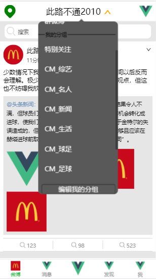
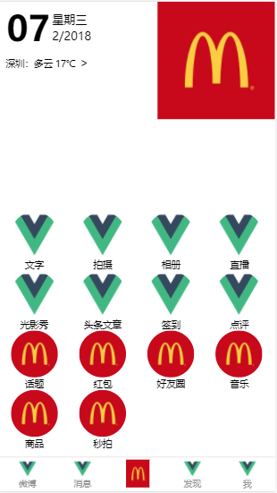
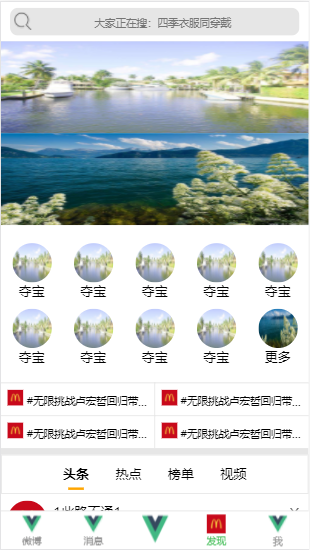
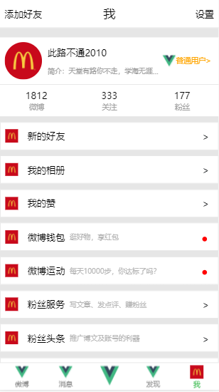

## 基于vue全家桶，仿新浪微博移动端简版

``` bash
#克隆项目
git clone git@github.com:cmh1996/vue-weibo.git

# 安装依赖
npm install

# 本地开发环境 访问http://localhost:8080
npm run dev

# 构建生产
npm run build

```

## 项目说明
该项目是我学习vue时写的第一个练手项目，主要目的是想练练手，入门vue，所以代码整体上比较简单。

图片都是随便找的，嘻嘻😋


## 项目截图


